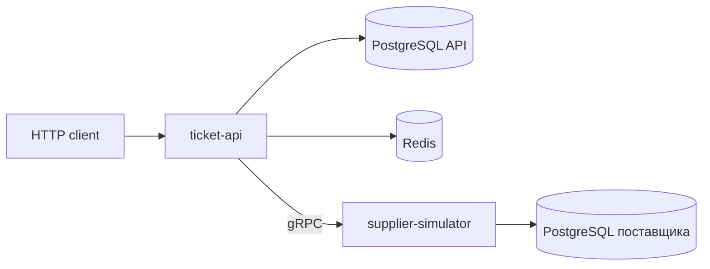

# Архитектура

## Общая модель

Ticket Aggregator API состоит из двух процессов:

1. `ticket-api` — внешний HTTP API, бизнес-логика агрегатора, основная PostgreSQL и Redis.
2. `supplier-simulator` — внутренний gRPC-сервис, который имитирует поиск и возвраты у поставщиков и хранит минимальный журнал выполненных возвратов в отдельной PostgreSQL.

API остаётся модульным монолитом: домены собираются в `cmd/api/main.go`, но общаются через небольшие интерфейсы из `contracts.go`. Supplier вынесен в отдельный процесс, потому что имитирует внешнюю интеграцию с независимым состоянием и сетевыми ошибками.

## Слои домена

Большинство доменов придерживаются одного шаблона:

- `handlers` разбирают HTTP-запросы, получают сведения о пользователе из контекста запроса или cookie и формируют ответ;
- `service` управляет выполнением пользовательского сценария и принимает бизнес-решения;
- `repository` выполняет SQL и атомарные команды хранения;
- `contracts.go` задаёт зависимости через интерфейсы;
- корневые файлы пакета содержат DTO, модели, статусы, правила и доменные ошибки.

Транзакция может технически выполняться repository-слоем, но порядок действий и условия переходов определяет service. Это особенно важно для оплаты и возврата.

## Домены

| Домен | Ответственность | Основные зависимости |
| --- | --- | --- |
| `auth` | регистрация, вход, JWT, refresh rotation, logout, восстановление пароля | PostgreSQL, Redis, mailer |
| `users` | профиль владельца аккаунта | PostgreSQL |
| `passengers` | сохранённые пассажиры и автосохранение после оплаты | PostgreSQL, documents transaction port |
| `documents` | документы, правила допустимости, mock-проверка и fingerprint | PostgreSQL |
| `search` | валидация маршрута, запрос поставщиков, объединение и кеширование выдачи | PostgreSQL, Redis, gRPC-сервис поставщиков |
| `orders` | создание заказа, snapshots пассажиров, документов и маршрутов, история и очистка устаревших данных | search, documents, passengers, bonus, PostgreSQL |
| `checkout` | атомарная оплата, статусы заказа и билетов, бонусы и автосохранение | PostgreSQL, mock payment provider, passengers |
| `bonus` | расчёт, баланс и история операций | PostgreSQL |
| `refunds` | расчёт условий, выполнение и повторная обработка возврата, идемпотентность и финансовый перерасчёт | PostgreSQL, gRPC-сервис поставщиков |
| `bookingaccess` | публичный поиск бронирования, подтверждение email кодом, временный гостевой токен и возврат | PostgreSQL, Redis, refunds |
| `trips` | публичный поиск состоявшихся бронирований по билету или номеру рейса | PostgreSQL |
| `supplier` | mock-предложения и исполнение возврата на стороне поставщика | PostgreSQL поставщика |

Пакеты `internal/platform` содержат общую инфраструктуру: config, подключение к PostgreSQL и Redis, ограничение частоты запросов, идентификаторы запросов, structured logging, health checks и graceful shutdown.

## PostgreSQL API

Основные группы таблиц:

- `users`, `saved_passengers`, `documents`, `document_rules` — аккаунт и пассажирские данные;
- `countries`, `cities`, `carriers` — справочники для поиска;
- `orders`, `order_passengers`, `tickets` — заказ и неизменяемые snapshots на момент оформления;
- `scheduled_trips`, `ticket_segments` — нормализованные сегменты маршрутов;
- `payments` — результат mock-оплаты;
- `refunds`, `refund_items` — локальная state machine возврата;
- `bonus_transactions` — журнал начислений, списаний, восстановления и долга.

### Почему используются snapshots

В `order_passengers` и `tickets` сохраняются данные, действовавшие при оформлении: пассажир, документ, тариф, правило возврата и сегменты. Последующее редактирование профиля или сохранённого пассажира не меняет историю купленного билета.

`scheduled_trips` выделены отдельно, чтобы одинаковый фактический сегмент не дублировался для каждого пассажира. `ticket_segments` связывает билет с одним или несколькими рейсами. Поэтому билет с авиапересадкой остаётся одним билетом, но содержит два сегмента с разными номерами рейсов.

### Транзакционные границы

- создание заказа атомарно сохраняет заказ, пассажиров, билеты и сегменты;
- успешная оплата под блокировками фиксирует payment, переводит заказ и билеты в `paid`, применяет бонусы и синхронизирует сохранённых пассажиров;
- завершение возврата атомарно меняет билеты, заказ, бонусы и локальную операцию возврата;
- `SELECT ... FOR UPDATE` защищает оплату и возврат от параллельного изменения одного заказа;
- пакетное удаление использует `SKIP LOCKED`, чтобы параллельные фоновые обработчики не блокировали друг друга.

## Supplier PostgreSQL

Supplier simulator не копирует полную модель билетов агрегатора. Он доверяет переданным идентификаторам и строго валидирует запрос, а у себя хранит только:

- `refund_operations` — результат исполнения по `(provider_code, idempotency_key)`;
- `refund_items` — билеты, суммы и применённые правила.

Такой журнал позволяет повторно вернуть тот же результат после превышения времени ожидания сетевого ответа и не выполнить внешний возврат дважды.

## Redis

Redis хранит только короткоживущие данные:

- временные данные регистрации, входа и восстановления пароля;
- коды подтверждения, счётчики попыток, время блокировки и блокировки конкурирующих операций;
- refresh-сессии и состояние ротации токенов;
- результаты поиска с TTL 10 минут;
- запросы подтверждения и токены гостевого доступа к бронированию;
- счётчики ограничения частоты запросов.

Пароли во временных данных регистрации не сохраняются открытым текстом: до записи в Redis создаётся bcrypt-хеш. Токены доступа к бронированию и refresh-токены индексируются по хешу.

Redis не является источником истории заказов, платежей или возвратов. Потеря его содержимого завершит временные сессии и очистит кеш, но не изменит подтверждённые бизнес-данные.

### Границы согласованности PostgreSQL и Redis

PostgreSQL и Redis не участвуют в общей транзакции. Для текущего масштаба проекта это принято как осознанное ограничение двух auth-сценариев:

- при подтверждении регистрации пользователь сначала создаётся в PostgreSQL, затем refresh-сессия сохраняется в Redis. Если Redis станет недоступен между этими действиями, аккаунт уже будет создан, хотя клиент получит ошибку и должен будет войти обычным способом;
- при смене пароля подтверждение сначала атомарно используется в Redis, затем новый hash сохраняется в PostgreSQL. Если запись в PostgreSQL завершится ошибкой, потребуется запросить новый код подтверждения.

Добавление распределённой транзакции или saga для этих редких сценариев усложнило бы учебный проект сильнее, чем повысило его практическую ценность.

## gRPC и поставщики

Контракт находится в `proto/supplier/v1/supplier.proto` и содержит три RPC:

- `SearchOffers` — получить предложения выбранного поставщика;
- `QuoteRefund` — узнать возможность и сумму возврата;
- `ExecuteRefund` — идемпотентно выполнить возврат у поставщика.

Сейчас определены три поставщика: `atlas`, `nexus`, `vertex`. Они используют разные наборы перевозчиков и диапазоны цен, независимо выбирают один из трёх общих тарифов, но получают одинаковые исходные данные для генерации и формируют совпадающие идентификаторы расписаний. Поэтому одна поездка может появиться у нескольких поставщиков с разной ценой и условиями возврата.

API объединяет предложения по `schedule_id + fare_type`. Если несколько поставщиков вернули один и тот же вариант и тариф, сохраняется более дешёвое предложение. Разные тарифы остаются отдельными вариантами, поскольку их возвратность различается.

## Concurrency

Параллельное выполнение используется на границах независимых операций:

- сервис поиска запускает отдельную горутину для каждого поставщика;
- ответы поставщиков собираются в общий канал и объединяются после завершения запросов;
- отказ одного поставщика не отменяет выдачу, если ответил хотя бы один;
- проверка готовности одновременно обращается к PostgreSQL, Redis и gRPC-сервису поставщиков;
- очистка устаревших заказов и повторная обработка незавершённых возвратов выполняются фоновыми горутинами;
- HTTP- и gRPC-серверы завершают работу вместе с фоновыми горутинами при корректной остановке приложения.

Генерация отдельных mock-предложений внутри сервиса поставщиков выполняется последовательно: это дешёвая вычислительная операция, для которой отдельный пул горутин не даёт полезного выигрыша. Горутины моделируют параллельные сетевые запросы к независимым поставщикам, что соответствует реальной задаче агрегатора.

## Возврат как последовательность согласованных операций

PostgreSQL агрегатора и базу данных поставщика нельзя включить в одну ACID-транзакцию. Поэтому возврат реализован как последовательность согласованных шагов, то есть небольшая saga:

1. локально создаётся `refund` в `processing`, билеты переходят в `refund_pending`;
2. API вызывает `ExecuteRefund` с общим `Idempotency-Key`;
3. при успехе локальная транзакция фиксирует `success`, `refunded`, финансы и бонусы;
4. при явном отказе поставщика операция становится `failed`, а билеты возвращаются в `paid`;
5. при неизвестном сетевом результате операция остаётся `processing` и попадает на повторную обработку;
6. после восьми попыток или 24 часов состояние становится `requires_review`.

`requires_review` намеренно не откатывает билеты в `paid`: поставщик мог выполнить возврат, а ответ мог потеряться. Автоматическое возвращение статуса создало бы риск повторной продажи или двойного возврата.

## Надёжность и эксплуатация

- `/health/live` подтверждает, что HTTP-процесс работает;
- `/health/ready` проверяет PostgreSQL, Redis и состояние gRPC-сервиса поставщиков;
- сервис поставщиков начинает с `NOT_SERVING` и становится `SERVING` только после успешной проверки соединения с базой данных;
- ошибка запуска завершает процесс ненулевым кодом;
- SIGINT/SIGTERM останавливают серверы и фоновые процессы с ограничением по времени и принудительным завершением при его превышении;
- `slog` пишет структурированные логи и переносит `request_id` из HTTP в gRPC;
- API возвращает клиенту только нормализованные `apierror`, внутренние причины остаются в логах.

## Осознанные упрощения

- все поставщики обслуживаются одним simulator-процессом;
- email выводится в консоль;
- оплата случайно успешна или отклонена без банковского API;
- document verification детерминированно имитирует внешний ответ;
- деньги представлены целым количеством рублей;
- при локальном запуске по HTTP refresh-cookie и cookie доступа к бронированию устанавливаются с `Secure=false`; перед публикацией по HTTPS этот параметр должен управляться конфигурацией;
- сейчас IP-адрес для rate limit берётся напрямую из `RemoteAddr`. Если между клиентом и приложением появится прокси-сервер, потребуется отдельно настроить получение реального IP клиента и доверять таким данным только от известных прокси-серверов;
- дата публичного поиска по номеру рейса трактуется как календарный день UTC, без пользовательского часового пояса;
- система не предназначена для реальных персональных или платёжных данных.
